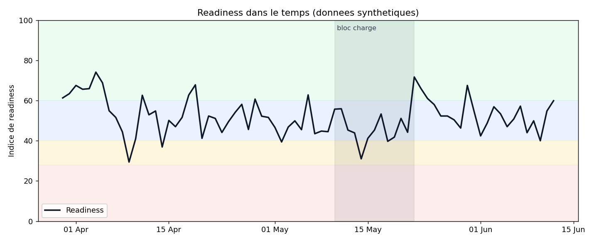

# Readiness App

Application de check-in quotidien de l'etat de forme d'un athlete d'endurance.
L'athlete exprime son etat en 5 questions sur ses sensations physiques et mental. L'app en deduit un indice de
**readiness relatif a sa propre baseline**, et restitue une tendance dans le
temps qui peut nourrir le profil utilisateur et des analyses plus globales.



## Idee directrice

Un score brut ("sommeil 3/5") ne veut rien dire. Il prend du sens
par rapport a l'habitude de l'athlete. Le modele compare donc chaque saisie a la
baseline individuelle (moyenne et ecart-type glissants sur 28 jours) plutot qu'a
un seuil universel. C'est le coeur de l'approche et ce qui distingue une mesure
exploitable d'un simple formulaire.

## Fonctionnalites

- **Check-in quotidien** : 5 items de wellness (echelle 1-5) + heures de sommeil + note libre. Une saisie par jour, modifiable.
- **Indice de readiness 0-100** avec statut relatif (au-dessus / dans / sous ta norme) et reco d'entrainement associee.
- **Vue longitudinale** : evolution de la readiness, des composantes et du sommeil.
- **Demarrage progressif** : tant que la baseline n'est pas etablie, le score bascule sur un mapping absolu, signale a l'utilisateur.
- **Historique demo** integre pour visualiser immediatement la valeur (75 jours simules avec un bloc d'entrainement charge).

## Installation

```bash
git clone <url-du-repo>
cd readiness-app
python -m venv .venv && source .venv/bin/activate
pip install -r requirements.txt
```

## Lancement

```bash
streamlit run app.py
```

Puis, dans la barre laterale, **Charger un historique demo** pour peupler l'app.

Pour l'analyse exploratoire et le graphe de validation :

```bash
python analysis.py
```

## Architecture

```
readiness-app/
├── app.py                # interface Streamlit (3 onglets)
├── analysis.py           # analyse DS + graphe de validation
├── src/
│   ├── config.py         # items, poids, fenetres, seuils (tout est ici)
│   ├── database.py       # persistance SQLite (1 check-in/jour)
│   ├── scoring.py        # calcul de la readiness (le coeur)
│   └── synthetic.py      # generateur d'historique demo
├── docs/
│   └── demarche.md       # demarche, choix, axes d'amelioration
├── data/                 # base SQLite (gitignore)
└── requirements.txt
```

La logique de score est isolee dans `src/scoring.py` et entierement pilotee par
`src/config.py` : on peut ajuster poids, fenetre de baseline et seuils sans
toucher au reste.

## Modele de readiness (resume)

1. z-score individuel de chaque composante vs baseline glissante (28 j, sans fuite du jour courant).
2. composite pondere des z-scores.
3. `readiness = 50 + 15 * z`, borne 0-100. 50 = ta norme.
4. hook `scoring.apply_training_load` pret a moduler le score avec la charge d'entrainement (ACWR) une fois le dataset dispo.

Details et justifications dans [`docs/demarche.md`](docs/demarche.md).
